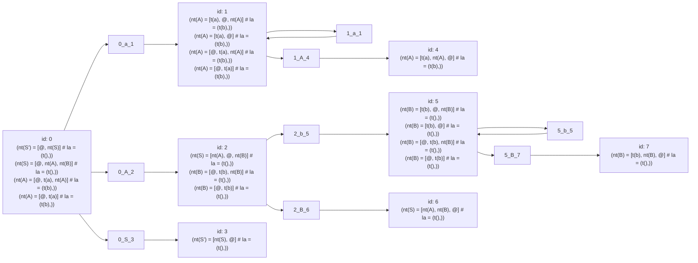

```mermaid
flowchart LR
0["id: 0
(nt(S') = [@, nt(S)] # la = (t(),))
(nt(S) = [@, nt(A), nt(B)] # la = (t(),))
(nt(A) = [@, t(a), nt(A)] # la = (t(b),))
(nt(A) = [@, t(a)] # la = (t(b),))
"]
1["id: 1
(nt(A) = [t(a), @, nt(A)] # la = (t(b),))
(nt(A) = [t(a), @] # la = (t(b),))
(nt(A) = [@, t(a), nt(A)] # la = (t(b),))
(nt(A) = [@, t(a)] # la = (t(b),))
"]
2["id: 2
(nt(S) = [nt(A), @, nt(B)] # la = (t(),))
(nt(B) = [@, t(b), nt(B)] # la = (t(),))
(nt(B) = [@, t(b)] # la = (t(),))
"]
3["id: 3
(nt(S') = [nt(S), @] # la = (t(),))
"]
4["id: 4
(nt(A) = [t(a), nt(A), @] # la = (t(b),))
"]
5["id: 5
(nt(B) = [t(b), @, nt(B)] # la = (t(),))
(nt(B) = [t(b), @] # la = (t(),))
(nt(B) = [@, t(b), nt(B)] # la = (t(),))
(nt(B) = [@, t(b)] # la = (t(),))
"]
6["id: 6
(nt(S) = [nt(A), nt(B), @] # la = (t(),))
"]
7["id: 7
(nt(B) = [t(b), nt(B), @] # la = (t(),))
"]

0 -->                     0_a_1 ---> 1
0 -->                     0_A_2 ---> 2
0 -->                     0_S_3 ---> 3
1 -->                     1_a_1 ---> 1
1 -->                     1_A_4 ---> 4
2 -->                     2_b_5 ---> 5
2 -->                     2_B_6 ---> 6
5 -->                     5_b_5 ---> 5
5 -->                     5_B_7 ---> 7
```