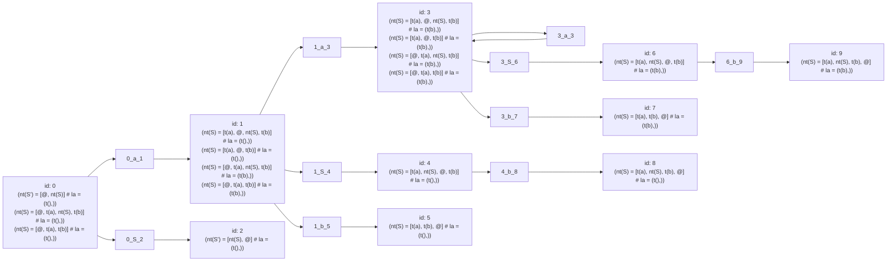

```mermaid
flowchart LR
0["id: 0
(nt(S') = [@, nt(S)] # la = (t(),))
(nt(S) = [@, t(a), nt(S), t(b)] # la = (t(),))
(nt(S) = [@, t(a), t(b)] # la = (t(),))
"]
1["id: 1
(nt(S) = [t(a), @, nt(S), t(b)] # la = (t(),))
(nt(S) = [t(a), @, t(b)] # la = (t(),))
(nt(S) = [@, t(a), nt(S), t(b)] # la = (t(b),))
(nt(S) = [@, t(a), t(b)] # la = (t(b),))
"]
2["id: 2
(nt(S') = [nt(S), @] # la = (t(),))
"]
3["id: 3
(nt(S) = [t(a), @, nt(S), t(b)] # la = (t(b),))
(nt(S) = [t(a), @, t(b)] # la = (t(b),))
(nt(S) = [@, t(a), nt(S), t(b)] # la = (t(b),))
(nt(S) = [@, t(a), t(b)] # la = (t(b),))
"]
4["id: 4
(nt(S) = [t(a), nt(S), @, t(b)] # la = (t(),))
"]
5["id: 5
(nt(S) = [t(a), t(b), @] # la = (t(),))
"]
6["id: 6
(nt(S) = [t(a), nt(S), @, t(b)] # la = (t(b),))
"]
7["id: 7
(nt(S) = [t(a), t(b), @] # la = (t(b),))
"]
8["id: 8
(nt(S) = [t(a), nt(S), t(b), @] # la = (t(),))
"]
9["id: 9
(nt(S) = [t(a), nt(S), t(b), @] # la = (t(b),))
"]

0 -->                     0_a_1 ---> 1
0 -->                     0_S_2 ---> 2
1 -->                     1_a_3 ---> 3
1 -->                     1_S_4 ---> 4
1 -->                     1_b_5 ---> 5
3 -->                     3_a_3 ---> 3
3 -->                     3_S_6 ---> 6
3 -->                     3_b_7 ---> 7
4 -->                     4_b_8 ---> 8
6 -->                     6_b_9 ---> 9
```