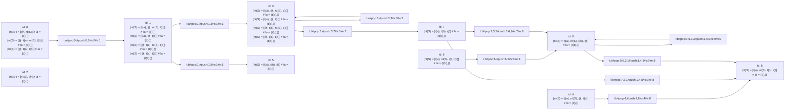

```mermaid
flowchart LR
0["id: 0
(nt(S') = [@, nt(S)] # la = (t(),))
(nt(S) = [@, t(a), nt(S), t(b)] # la = (t(),))
(nt(S) = [@, t(a), t(b)] # la = (t(),))
"]
1["id: 1
(nt(S) = [t(a), @, nt(S), t(b)] # la = (t(),))
(nt(S) = [t(a), @, t(b)] # la = (t(),))
(nt(S) = [@, t(a), nt(S), t(b)] # la = (t(b),))
(nt(S) = [@, t(a), t(b)] # la = (t(b),))
"]
2["id: 2
(nt(S') = [nt(S), @] # la = (t(),))
"]
3["id: 3
(nt(S) = [t(a), @, nt(S), t(b)] # la = (t(b),))
(nt(S) = [t(a), @, t(b)] # la = (t(b),))
(nt(S) = [@, t(a), nt(S), t(b)] # la = (t(b),))
(nt(S) = [@, t(a), t(b)] # la = (t(b),))
"]
4["id: 4
(nt(S) = [t(a), nt(S), @, t(b)] # la = (t(),))
"]
5["id: 5
(nt(S) = [t(a), t(b), @] # la = (t(),))
"]
6["id: 6
(nt(S) = [t(a), nt(S), @, t(b)] # la = (t(b),))
"]
7["id: 7
(nt(S) = [t(a), t(b), @] # la = (t(b),))
"]
8["id: 8
(nt(S) = [t(a), nt(S), t(b), @] # la = (t(),))
"]
9["id: 9
(nt(S) = [t(a), nt(S), t(b), @] # la = (t(b),))
"]

0 --> t:a#pop:0,#push:0,1#s:0#e:1 ---> 1
1 --> t:a#pop:1,#push:1,3#s:1#e:3 ---> 3
1 --> t:b#pop:1,#push:1,5#s:1#e:5 ---> 5
3 --> t:a#pop:3,#push:3,3#s:3#e:3 ---> 3
3 --> t:b#pop:3,#push:3,7#s:3#e:7 ---> 7
4 --> t:b#pop:4,#push:4,8#s:4#e:8 ---> 8
6 --> t:b#pop:6,#push:6,9#s:6#e:9 ---> 9
7 --> t:b#pop:7,3,1#push:1,4,8#s:7#e:8 ---> 8
7 --> t:b#pop:7,3,3#push:3,6,9#s:7#e:9 ---> 9
9 --> t:b#pop:9,6,3,1#push:1,4,8#s:9#e:8 ---> 8
9 --> t:b#pop:9,6,3,3#push:3,6,9#s:9#e:9 ---> 9
```